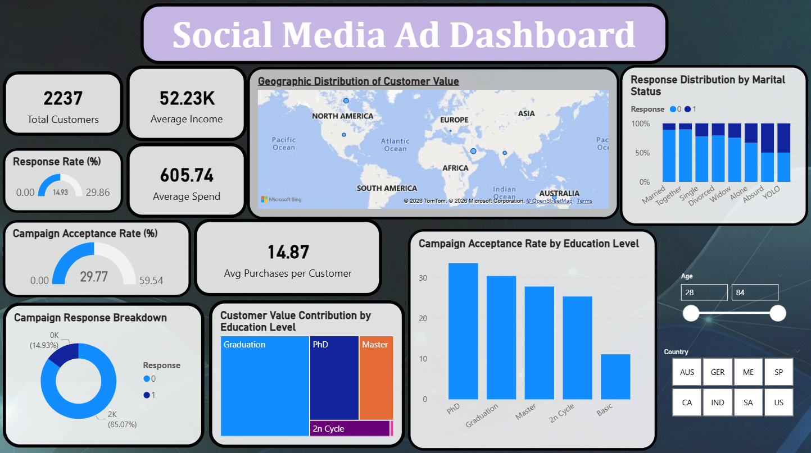
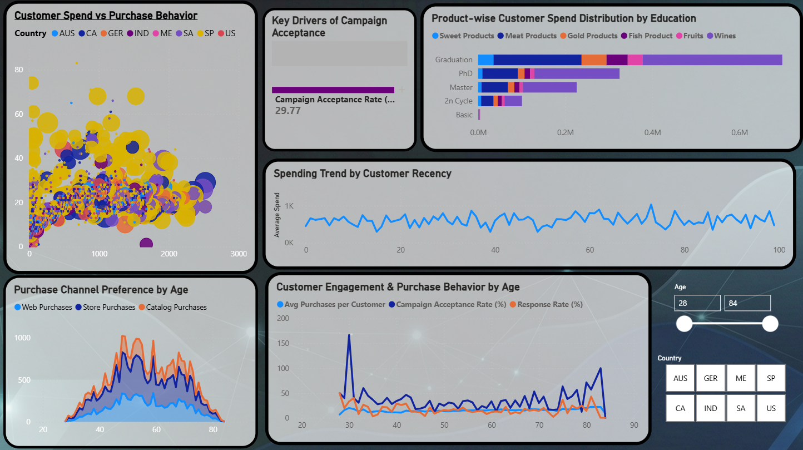

# 📣 Social Media Ad Performance Dashboard | Power BI


---

## 🚀 Project Overview

This project is developed as part of the **Data Science & Analytics Internship at Future Interns**.  
The objective of this task is to analyze **marketing campaign and customer behavior data** and design a **professional, interactive Power BI dashboard** that helps businesses evaluate campaign performance and customer engagement.

The dashboard focuses on **marketing analytics and business storytelling**, enabling stakeholders to understand what drives campaign success and how customer behavior varies across different segments.

---

## 🎯 Business Objectives

The dashboard answers the following key business questions:

- 📣 How effective are the marketing campaigns?
- 📊 What is the **response rate** and **campaign acceptance rate**?
- 👥 Which **customer segments** respond better to campaigns?
- 🛍️ How does **customer spending vary by product category**?
- 🎯 Which factors influence **campaign acceptance and purchases**?
- 🌍 How does customer behavior differ across **age and geography**?

---

## 📄 Dashboard Pages Overview

### 🔹 Page 1: Campaign Performance Overview



Designed for **marketing managers and decision-makers** to quickly assess overall campaign health.

**Key Visuals & KPIs:**
- 👥 Total Customers  
- 💰 Average Income  
- 🛒 Average Spend  
- 📣 Response Rate (%)  
- 🎯 Campaign Acceptance Rate (%)  
- 🔁 Average Purchases per Customer  
- 🍩 Campaign Response Breakdown  
- 🧩 Customer Value Contribution by Education Level  
- 📊 Campaign Acceptance Rate by Education  
- 📊 Response Distribution by Marital Status  
- 🗺️ Geographic Distribution of Customer Value  
- 🎛️ Age & Country slicers for dynamic filtering  

---

### 🔹 Page 2: Customer Behavior & Insights



Designed for **analysts and marketing teams** to explore deeper behavioral patterns.

**Key Visuals:**
- 🔵 Customer Spend vs Purchase Behavior (Scatter Plot)  
- 📊 Product-wise Customer Spend Distribution  
  *(Wines, Meat, Fish, Sweet, Gold, Fruits)*  
- 📉 Purchase Channel Preference by Age  
- 📈 Spending Trend by Customer Recency  
- 📈 Engagement & Purchase Metrics by Age  
- 🌳 Key Drivers of Campaign Acceptance  

---

## 🛠️ Tools & Technologies Used

- **Power BI Desktop** – Dashboard creation & visualization  
- **Python (Pandas, NumPy)** – Data cleaning & preprocessing  
- **CSV Dataset**  
- **DAX (Data Analysis Expressions)** – KPI calculations  

---

## 📐 Key DAX Measures Used

```DAX
Total Customers = DISTINCTCOUNT(FUTURE_DS_02_Dataset[ID])

Average Income = AVERAGE(FUTURE_DS_02_Dataset[income])

Average Spend = AVERAGE(FUTURE_DS_02_Dataset[total_spend])

Avg Purchases per Customer =
AVERAGE(FUTURE_DS_02_Dataset[total_purchases])

Response Rate (%) =
DIVIDE(
    SUM(FUTURE_DS_02_Dataset[response]),
    COUNT(FUTURE_DS_02_Dataset[ID])
) * 100

Campaign Acceptance Rate (%) =
DIVIDE(
    SUM(FUTURE_DS_02_Dataset[campaigns_accepted]),
    COUNT(FUTURE_DS_02_Dataset[ID])
) * 100
```

---

## 🎨 Dashboard Design & Theme

- 🌙 Dark mode dashboard for a premium, modern look

- 🎯 Clean and structured layout for better readability

- 🎨 Consistent color palette across all visuals

- 📊 Focus on clarity, insights, and decision-making

---

## 📁 Repository Structure

```
FUTURE_DS_02/
│
├── Dashboard/
│   └── Social_Media_Ad_Dashboard.pbix
│
├── Dataset/
│   └── FUTURE_DS_02_Dataset.csv
│
├── Screenshots/
│   ├── Page1_Overview.png
│   └── Page2_Insights.png
│
└── README.md
```

---

## 🔑 Key Insights & Findings

- 📣 Campaign acceptance improves with repeated exposure

- 🎓 Higher education segments contribute more to total customer value

- 👥 Middle-aged customers show higher engagement and spending

- 🛍️ Customer spend is concentrated in a few key product categories

- 🎯 Demographic and behavioral factors strongly influence campaign success

---

## 🏁 Conclusion

This project demonstrates the ability to:

- Analyze marketing and customer behavior data

- Design **business-oriented Power BI dashboards**

- Apply **data storytelling and analytical thinking**

- Translate raw data into **actionable marketing insights**

The dashboard is suitable for **real-world marketing performance analysis** and strategic decision-making.

---

## 🙌 Acknowledgment

This project was completed as part of the
Future Interns – Data Science & Analytics Internship Program.

---

## 👤 Author

**Daksh Khandelwal**   
Data Science & Analytics Intern – Future Interns